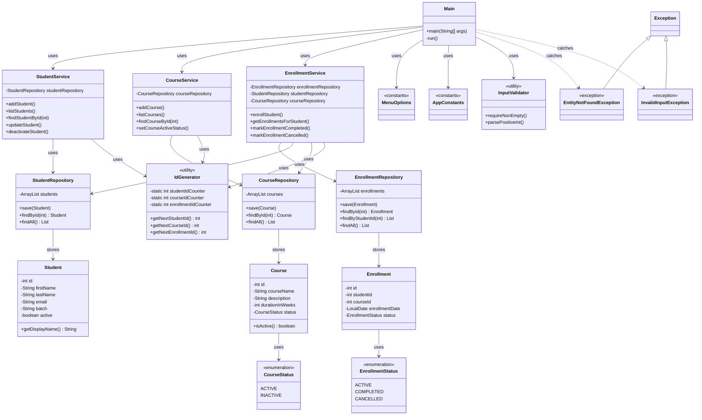

# LearnTrack

A console-based **Student & Course Management System** built with Core Java. Admins can manage students, courses, and enrollments through a menu-driven terminal interface. All data is stored in memory using `ArrayList`.

**Repository:** [github.com/anjali-venugopal/LearnTrack-Submission](https://github.com/anjali-venugopal/LearnTrack-Submission)

## Features

- Add, view, search, update, and deactivate students
- Add, view, and activate/deactivate courses
- Enroll students in courses and track enrollment status
- Graceful error handling for invalid input and missing records

## Project Structure

```
src/com/airtribe/learntrack/
├── Main.java
├── entity/         Student, Course, Enrollment
├── repository/     In-memory data storage (ArrayList)
├── service/        Business logic
├── exception/      Custom checked exceptions
├── util/           IdGenerator, InputValidator
├── constants/      MenuOptions, AppConstants
└── enums/          EnrollmentStatus, CourseStatus
```

## Class Diagram




## Documentation

| File | Description |
|------|-------------|
| [docs/Setup_Instructions.md](docs/Setup_Instructions.md) | JDK installation and Hello World |
| [docs/JVM_Basics.md](docs/JVM_Basics.md) | JDK, JRE, JVM, and bytecode |
| [docs/Design_Notes.md](docs/Design_Notes.md) | Design decisions and architecture |


## Author

**Anjali Venugopal** 
