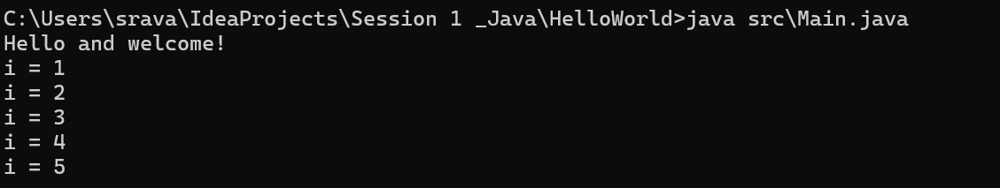

# Setup Instructions

## JDK Version

**java version**   "26.0.1" 2026-04-21 
**Java(TM) SE Runtime Environment** (build 26.0.1+8-34)
**Java HotSpot(TM) 64-Bit Server VM**  (build 26.0.1+8-34, mixed mode, sharing)

## Screenshots or brief explanation of “Hello World” program run.

Explanation :
In first line printing Hello and Welcome and then looping from i=1 to 5 and printing the values of i 
Expected output (example):
Hello and welcome!
i = 1
i = 2
i = 3
i = 4
i = 5
